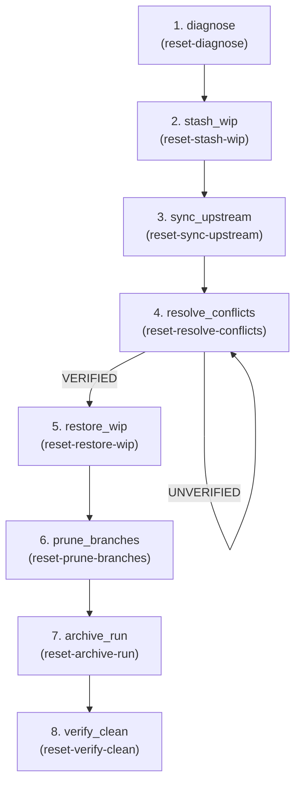

# Reset — Utility Flow (Injected)

**Goal:** Safely synchronize work branch with upstream when divergence is detected, preserving WIP and resolving conflicts.

**Question:** Is the work branch synchronized with upstream?

**Core Outputs:** `reset_receipt.json`, `verification_report.md`

**Type:** Utility flow (not part of core SDLC sequence)

---

## Utility Flow Semantics

This is a **utility flow**—it's not part of the standard SDLC sequence (Flows 1-7). Instead:

- **Injected via INJECT_FLOW** when work branch diverges from upstream
- **Stack-frame pattern**: On completion, returns to the interrupted flow
- **Triggered by**: `upstream_diverged` signal (detected during Flow 3-5 execution)
- **On failure**: Pauses for human intervention

The orchestrator detects divergence during Build/Review/Gate flows and injects Flow 8 automatically. When Flow 8 completes successfully, execution resumes at the interrupted step.

---

## Artifact Paths

For a given run (`run-id`), define:

- `RUN_BASE = swarm/runs/<run-id>`

All artifacts for this flow are written under:

- `RUN_BASE/reset/`

For example:

- `RUN_BASE/reset/divergence_report.md`
- `RUN_BASE/reset/stash_manifest.md`
- `RUN_BASE/reset/sync_report.md`
- `RUN_BASE/reset/conflict_resolution.md`
- `RUN_BASE/reset/restore_report.md`
- `RUN_BASE/reset/prune_report.md`
- `RUN_BASE/reset/archive_manifest.md`
- `RUN_BASE/reset/reset_receipt.json`
- `RUN_BASE/reset/verification_report.md`

---

## Upstream Inputs

Flow 8 is triggered by context, not upstream flow artifacts. It reads:

- **Git state**: Current branch, divergence from origin/main, working tree status
- **Stash state**: Uncommitted changes to preserve
- **Run artifacts**: Current run's artifacts (for archiving decisions)

---

## Orchestration Model

Flow specs describe **what** happens; the orchestrator (top-level Claude) decides **how** to invoke agents.

### Injection Trigger

Flow 8 is injected when the `InjectionTriggerDetector` fires `upstream_diverged`:

```python
# Detection conditions:
# - git_status.behind_count > 0
# - git_status.diverged = True
# - Step output mentioning "diverged" or "out of sync"
```

### Two Execution Levels

1. **Orchestrator (top-level Claude)**:
   - Detects divergence during Build/Review/Gate execution
   - Pushes current context to interruption stack
   - Invokes Flow 8 agents in sequence
   - On completion, pops stack and resumes interrupted flow

2. **All Agents** (reset-diagnose, reset-sync-upstream, etc.):
   - Use tools declared in their frontmatter (Read, Write, Bash, Glob, Grep)
   - Use safe git commands only (no --force, no --hard)
   - Document all actions for audit trail

### Stack-Frame Pattern

When Flow 8 is injected:

1. Current step context pushed to `interruption_stack`
2. Resume point recorded in `resume_stack`
3. Flow 8 steps execute in sequence
4. On completion with `on_complete.next_flow: "return"`:
   - Pop both stacks
   - Resume at the interrupted step
5. On failure with `on_failure.next_flow: "pause"`:
   - Execution pauses for human intervention

---

## Downstream Contract

Flow 8 is "complete" when these exist:

- `divergence_report.md` — Initial analysis of upstream divergence
- `sync_report.md` — Upstream fetch results
- `conflict_resolution.md` — Conflict resolution actions (may be empty if no conflicts)
- `verification_report.md` — Final verification of clean state
- `reset_receipt.json` — Structured receipt for audit

Pass artifacts (returned to interrupted flow):
- `sync_report.md`
- `conflict_resolution.md`

---

## Agents (8 domain + cross-cutting)

| Agent | Category | Responsibility |
|-------|----------|----------------|
| reset-diagnose | analytics | Analyze upstream divergence, identify conflicts, assess severity → `divergence_report.md` |
| reset-stash-wip | impl | Stash WIP changes before sync → `stash_manifest.md` |
| reset-sync-upstream | impl | Fetch upstream without merging → `sync_report.md` |
| reset-resolve-conflicts | impl | Resolve merge conflicts (may iterate) → `conflict_resolution.md` |
| reset-restore-wip | impl | Restore stashed WIP → `restore_report.md` |
| reset-prune-branches | impl | Clean up stale branches → `prune_report.md` |
| reset-archive-run | impl | Archive run artifacts → `archive_manifest.md` |
| reset-verify-clean | verify | Verify clean state → `reset_receipt.json`, `verification_report.md` |

**Cross-cutting used:** clarifier, repo-operator

---

<!-- FLOW AUTOGEN START -->
### Flow structure



### Steps

| # | Step | Agents | Role |
| - | ---- | ------ | ---- |
| 1 | `diagnose` | `reset-diagnose` — Analyze divergence | Analyze upstream divergence, identify conflicts, assess severity. |
| 2 | `stash_wip` | `reset-stash-wip` — Stash WIP changes | Stash uncommitted changes before sync operations. |
| 3 | `sync_upstream` | `reset-sync-upstream` — Fetch upstream | Fetch upstream changes without merging. |
| 4 | `resolve_conflicts` | `reset-resolve-conflicts` — Resolve conflicts | Resolve merge conflicts (microloop, max 3 iterations). |
| 5 | `restore_wip` | `reset-restore-wip` — Restore WIP | Restore stashed changes after sync. |
| 6 | `prune_branches` | `reset-prune-branches` — Prune stale branches | Clean up stale/deleted branches. |
| 7 | `archive_run` | `reset-archive-run` — Archive artifacts | Archive run artifacts before cleanup. |
| 8 | `verify_clean` | `reset-verify-clean` — Verify clean state | Final verification of repository integrity. |
<!-- FLOW AUTOGEN END -->

---

## Orchestration Strategy

Reset is a **linear utility flow** with one conditional microloop for conflict resolution.

### Stash-Sync-Restore Pattern

1. **Stash**: Preserve uncommitted work before any sync operations
2. **Sync**: Fetch upstream and integrate changes (merge or rebase based on context)
3. **Restore**: Re-apply stashed work after sync completes

This pattern ensures work-in-progress is never lost during synchronization.

### Conflict Resolution Loop

The `resolve_conflicts` step may iterate up to 3 times:

- **Iteration 1**: Apply deterministic resolution strategies (ours/theirs for known patterns)
- **Iteration 2**: Use semantic understanding for remaining conflicts
- **Iteration 3**: Document unresolvable conflicts for human review

Exit conditions:
- `status: VERIFIED` — All conflicts resolved
- `status: NO_CONFLICTS` — No conflicts existed
- `max_iterations: 3` — Document remaining conflicts and continue

### Key Principle: Safe Git Operations Only

All agents use safe git commands:
- ✅ `git fetch`, `git stash`, `git merge`, `git checkout`
- ✅ `git branch -d` (safe delete)
- ✅ `git remote prune`
- ❌ `git push --force`, `git reset --hard`, `git clean -fd`

---

## Status States

Agents set status in their output artifacts:

- **VERIFIED** — Step completed successfully
- **UNVERIFIED** — Step has concerns; documented in artifact
- **NO_CONFLICTS** — Special status for resolve_conflicts when no conflicts exist
- **BLOCKED** — Couldn't run step; missing prerequisites

The `verify_clean` agent produces the final `reset_receipt.json` with overall status.

---

## Reset Receipt Structure

`reset_receipt.json` contains:

```yaml
status: VERIFIED | UNVERIFIED | BLOCKED

steps_completed:
  diagnose: VERIFIED
  stash_wip: VERIFIED
  sync_upstream: VERIFIED
  resolve_conflicts: VERIFIED  # or NO_CONFLICTS
  restore_wip: VERIFIED
  prune_branches: VERIFIED
  archive_run: VERIFIED
  verify_clean: VERIFIED

sync_summary:
  commits_behind: 5
  commits_integrated: 5
  conflicts_resolved: 2
  conflicts_pending: 0

wip_summary:
  changes_stashed: true
  changes_restored: true
  restore_conflicts: 0

verification:
  working_tree_clean: true
  upstream_synced: true
  stash_empty: true

concerns: []  # Any documented concerns

timestamp: "2024-01-15T10:30:00Z"
```

---

## Rerun Semantics

Flow 8 can be re-run:
- When previous sync was incomplete
- When new upstream changes appear during execution
- When human intervention resolved issues and wants to verify

Agents tolerate existing artifacts:
- `reset-diagnose` reads previous reports for context
- `reset-verify-clean` considers previous verification history

---

## Notes

- **Utility flow**: Not in SDLC sequence; injected when needed
- **Safe operations only**: No force operations, no destructive commands
- **Preserves WIP**: Stash-sync-restore pattern protects uncommitted work
- **Stack-frame return**: Resumes interrupted flow on completion
- **Human gate on failure**: Pauses for intervention if sync fails
- **Audit trail**: Full documentation of all actions in artifacts

---

## Out-of-the-Box Implementation

This flow uses **only local files and git**:

- Git commands for sync/stash/branch operations
- Write artifacts to `RUN_BASE/reset/`
- No external services required

Works immediately on clone.
